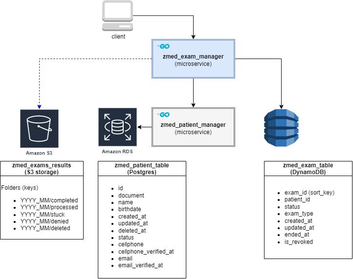

# microservice zmed_patient_manager
This is a golang microservice study case that manages patient's registry.

It makes part of a software architecture with microservices and AWS infrastructure prepared to handle exams for the fictional "ZMED" company.

## ZMED exams's architecture diagram

#### microservices
- **zmed_exam_manager** (Golang): manages exams registry in a dynamoDB table.
- **zmed_patient_manager** (Golang): manages patients registry in a RDS(Postgres).

#### storage
- **zmed_exam_table** (DynamoDB): Stores exam's registry.
- **zmed_patient_table** (RDS): Stores patient's registry.
- **zmed_exams_results** (S3): Stores exam's results.

## Endpoints
> In progress

# Installation
### Environment Variables
```azure
DB_HOST=localhost
DB_PORT=5432
DB_NAME=postgres
DB_USER=zmed
DB_PASSWORD=passw0rd


```
### Running locally
A simple way to get started is to
1. download this repository:
```
git clone https://github.com/yuripiffer/zmed_patient_manager.git
```
2. Export the environment variables listed above.
3. Run the Postgres database.
> In progress

## License
This is an open-source and free software release.
